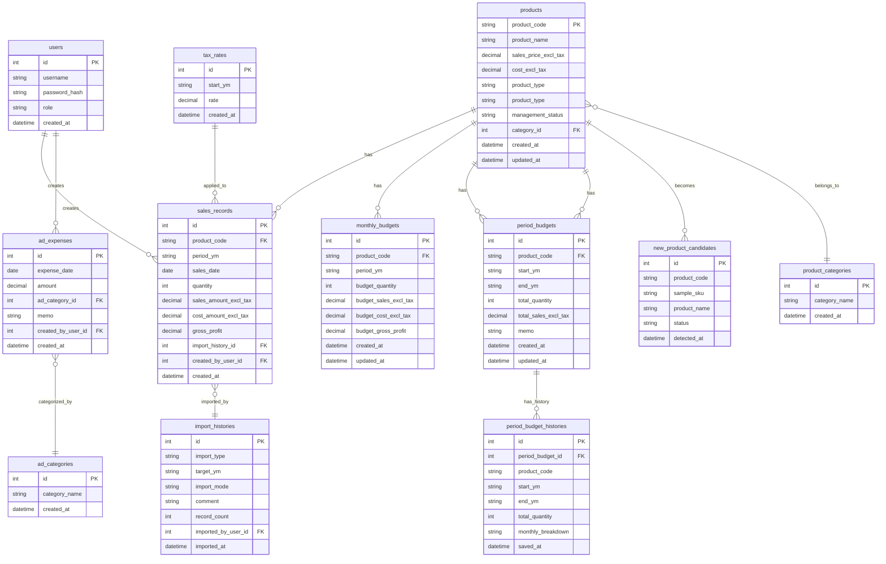
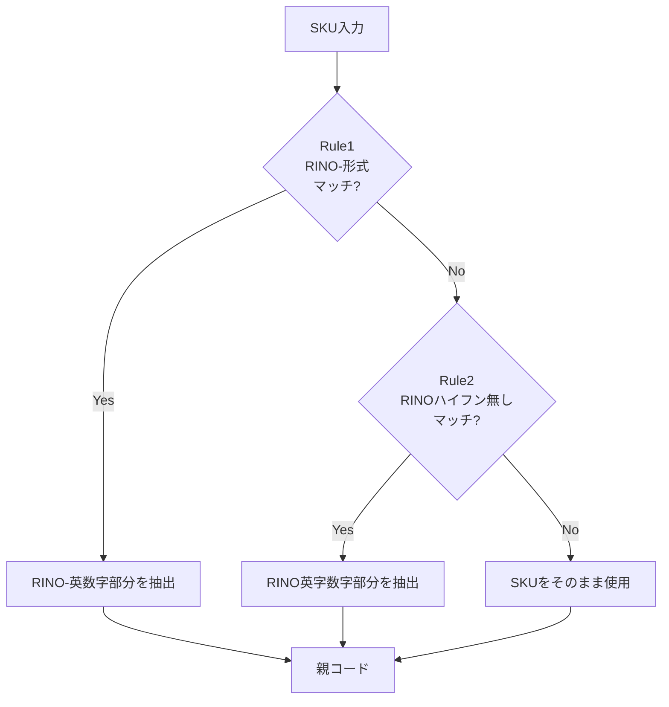

# Rinori 販売管理システム 詳細仕様書 V1.1
## 第1部：システム概要とデータベース設計

**バージョン**: 1.1  
**作成日**: 2025-12-05  
**基準文書**: Rinori 販売管理システム 要件定義書_V1.1

---

## 変更履歴

| バージョン | 日付 | 変更内容 |
|-----------|------|---------|
| 1.0 | 2025-12-04 | 初版作成 |
| 1.1 | 2025-12-05 | ユーザー権限機能追加、SKU変換ルール変更、期間予算ロジック変更、画面削除対応 |

---

## 1. システム概要

### 1.1 目的
小規模D2Cブランド Rinori のための販売実績・予算・PL（損益）を商品単位・月単位・期間単位で可視化する社内向けWebアプリケーション。

ネクストエンジン（NE）出力データを基礎に、商品マスタ・売上実績・広告費・予算を一元管理し、経営判断を支える。

### 1.2 技術要件
- **対象ブラウザ**: PC版 Google Chrome のみサポート
- **システム形態**: 社内向け Web アプリケーション
- **データ単位**: 月次集計（YYYY-MM形式）、将来的に日次対応
- **文字コード**: UTF-8
- **数値丸め**: 税抜換算時は HALF_UP（四捨五入）
- **同時アクセス**: 想定3名以内

### 1.3 用語定義

| 用語 | 定義 |
|------|------|
| SKU | ネクストエンジンで管理される商品コード（サイズ・色などのバリエーション含む） |
| 親コード（型番） | SKUから変換された商品の基本コード（バリエーションを除いた商品識別子） |
| 管理中 | 売上・予算・PLの集計対象となる商品ステータス |
| 管理外 | 集計対象外となる商品ステータス（廃盤商品など） |
| 対象年月 | YYYY-MM形式の年月（例: 2025-10） |
| 税別 | 税抜金額（消費税を除いた金額） |
| マスター権限 | すべての機能にアクセス可能な権限（オーナー） |
| スタッフ権限 | 一部機能に制限がある権限（スタッフ） |

---

## 2. ユーザー権限仕様（V1.1新規追加）

### 2.1 権限の種類

| 権限 | 説明 | 対象ユーザー |
|------|------|------------|
| マスター権限 | すべての画面・設定・機能にアクセス可能 | オーナー |
| スタッフ権限 | 一部機能に制限あり | スタッフ |

### 2.2 スタッフ権限でアクセス可能な機能

**✅ アクセス可能**:
- 広告費入力
- 例外実績入力（手入力実績）
- 商品別の実績閲覧
- 商品別の予算 vs 実績閲覧
- 商品別PL閲覧

**🔴 アクセス不可（非表示）**:
- 月次PL・期間PLの「総合計」
  - 総売上
  - 総原価
  - 総粗利
  - 総広告費
  - 総利益
  - 各率（原価率・粗利率・広告率・利益率）

**注意**: 各商品別の実績・PLは閲覧可能。総合計のみ非表示。

### 2.3 権限制御の実装方針

**画面レベル**:
- ログイン時にユーザー権限を取得
- 画面表示時に権限をチェック
- スタッフ権限の場合、総合計セクションを非表示

**データレベル**:
- 商品別データは権限に関わらず取得可能
- 総合計データはマスター権限のみ取得

---

## 3. データベース設計

### 3.1 ER図概要



### 3.2 テーブル定義

#### 3.2.1 users（ユーザーマスタ）【V1.1新規追加】

ユーザーアカウントと権限を管理するテーブル。

| カラム名 | 型 | NULL | デフォルト | 説明 |
|---------|-----|------|-----------|------|
| id | INT | NOT NULL | AUTO_INCREMENT | 主キー |
| username | VARCHAR(50) | NOT NULL | - | ユーザー名 |
| password_hash | VARCHAR(255) | NOT NULL | - | パスワードハッシュ |
| role | VARCHAR(20) | NOT NULL | 'staff' | 権限: 'master'（マスター）/ 'staff'（スタッフ） |
| created_at | DATETIME | NOT NULL | CURRENT_TIMESTAMP | 登録日時 |

**主キー**: id  
**ユニーク制約**: username  
**インデックス**: idx_role (role)

**制約**:
- role は 'master' または 'staff' のみ

**初期データ**:
- username: 'admin', role: 'master'（初期管理者アカウント）

#### 3.2.2 products（商品マスタ）

商品の基本情報を管理するマスタテーブル。

| カラム名 | 型 | NULL | デフォルト | 説明 |
|---------|-----|------|-----------|------|
| product_code | VARCHAR(50) | NOT NULL | - | 親コード（型番）。主キー |
| sample_sku | VARCHAR(100) | NULL | NULL | 元SKUの例（参考用） |
| product_name | VARCHAR(200) | NULL | NULL | 商品名 |
| sales_price_excl_tax | DECIMAL(10,2) | NULL | NULL | 販売価格（税別） |
| cost_excl_tax | DECIMAL(10,2) | NULL | NULL | 原価（税別） |
| product_type | VARCHAR(20) | NOT NULL | 'own' | 商品区分: 'own'（自社）/ 'purchase'（仕入） |
| management_status | VARCHAR(20) | NOT NULL | 'managed' | 管理ステータス: 'managed'（管理中）/ 'unmanaged'（管理外） |
| category_id | INT | NULL | NULL | 商品カテゴリID（外部キー）【将来拡張用】 |
| created_at | DATETIME | NOT NULL | CURRENT_TIMESTAMP | 登録日時 |
| updated_at | DATETIME | NOT NULL | CURRENT_TIMESTAMP ON UPDATE | 更新日時 |

**主キー**: product_code  
**インデックス**: 
- idx_management_status (management_status)
- idx_product_type (product_type)
- idx_category_id (category_id)

**制約**:
- product_type は 'own' または 'purchase' のみ
- management_status は 'managed' または 'unmanaged' のみ

**備考**:
- 管理中（managed）の商品のみが集計対象
- 管理外（unmanaged）の商品は売上CSVに存在しても集計から除外

#### 3.2.3 sales_records（売上実績）

月次の商品別売上実績を記録するトランザクションテーブル。

| カラム名 | 型 | NULL | デフォルト | 説明 |
|---------|-----|------|-----------|------|
| id | INT | NOT NULL | AUTO_INCREMENT | 主キー |
| product_code | VARCHAR(50) | NOT NULL | - | 商品コード（外部キー） |
| period_ym | CHAR(7) | NOT NULL | - | 対象年月（YYYY-MM形式） |
| sales_date | DATE | NULL | NULL | 売上日（将来拡張用、現在はNULL運用）【V1.1追加】 |
| quantity | INT | NOT NULL | 0 | 販売数量 |
| sales_amount_excl_tax | DECIMAL(12,2) | NOT NULL | 0.00 | 売上金額（税別） |
| cost_amount_excl_tax | DECIMAL(12,2) | NOT NULL | 0.00 | 原価金額（税別） |
| gross_profit | DECIMAL(12,2) | NOT NULL | 0.00 | 粗利（売上−原価） |
| import_history_id | INT | NULL | NULL | 取込履歴ID（外部キー） |
| created_by_user_id | INT | NULL | NULL | 作成ユーザーID（外部キー）【V1.1追加】 |
| created_at | DATETIME | NOT NULL | CURRENT_TIMESTAMP | 登録日時 |

**主キー**: id  
**外部キー**: 
- product_code → products(product_code)
- import_history_id → import_histories(id)
- created_by_user_id → users(id)

**インデックス**:
- idx_period_ym (period_ym)
- idx_product_period (product_code, period_ym)
- idx_sales_date (sales_date)【V1.1追加】

**備考**:
- sales_date は将来の日次PL対応のために確保（現在はNULL）
- gross_profit は sales_amount_excl_tax - cost_amount_excl_tax で自動計算

#### 3.2.4 monthly_budgets（月別予算）

商品別・月別の予算を管理するテーブル。

| カラム名 | 型 | NULL | デフォルト | 説明 |
|---------|-----|------|-----------|------|
| id | INT | NOT NULL | AUTO_INCREMENT | 主キー |
| product_code | VARCHAR(50) | NOT NULL | - | 商品コード（外部キー） |
| period_ym | CHAR(7) | NOT NULL | - | 対象年月（YYYY-MM形式） |
| budget_quantity | INT | NOT NULL | 0 | 予算数量 |
| budget_sales_excl_tax | DECIMAL(12,2) | NOT NULL | 0.00 | 予算売上（税別） |
| budget_cost_excl_tax | DECIMAL(12,2) | NOT NULL | 0.00 | 予算原価（税別） |
| budget_gross_profit | DECIMAL(12,2) | NOT NULL | 0.00 | 予算粗利 |
| created_at | DATETIME | NOT NULL | CURRENT_TIMESTAMP | 登録日時 |
| updated_at | DATETIME | NOT NULL | CURRENT_TIMESTAMP ON UPDATE | 更新日時 |

**主キー**: id  
**外部キー**: product_code → products(product_code)  
**ユニーク制約**: (product_code, period_ym)  
**インデックス**: idx_period_ym (period_ym)

**備考**:
- budget_sales_excl_tax = sales_price_excl_tax × budget_quantity（初期値、手動修正可）
- budget_cost_excl_tax = cost_excl_tax × budget_quantity
- budget_gross_profit = budget_sales_excl_tax - budget_cost_excl_tax

#### 3.2.5 period_budgets（期間予算）

商品別の期間予算（複数月にわたる予算）を管理するテーブル。

| カラム名 | 型 | NULL | デフォルト | 説明 |
|---------|-----|------|-----------|------|
| id | INT | NOT NULL | AUTO_INCREMENT | 主キー |
| product_code | VARCHAR(50) | NOT NULL | - | 商品コード（外部キー） |
| start_ym | CHAR(7) | NOT NULL | - | 開始年月（YYYY-MM形式） |
| end_ym | CHAR(7) | NOT NULL | - | 終了年月（YYYY-MM形式） |
| total_quantity | INT | NOT NULL | 0 | 期間合計数量 |
| total_sales_excl_tax | DECIMAL(12,2) | NULL | NULL | 期間合計売上（任意） |
| memo | TEXT | NULL | NULL | 備考 |
| created_at | DATETIME | NOT NULL | CURRENT_TIMESTAMP | 登録日時 |
| updated_at | DATETIME | NOT NULL | CURRENT_TIMESTAMP ON UPDATE | 更新日時 |

**主キー**: id  
**外部キー**: product_code → products(product_code)  
**インデックス**: idx_product_period (product_code, start_ym, end_ym)

**備考**:
- 期間予算を登録すると、システムが期間内の月に等分して monthly_budgets に反映
- 端数は最終月に寄せる【V1.1変更】

#### 3.2.6 period_budget_histories（期間予算履歴）【V1.1新規追加】

期間予算の変更履歴を保持するテーブル。

| カラム名 | 型 | NULL | デフォルト | 説明 |
|---------|-----|------|-----------|------|
| id | INT | NOT NULL | AUTO_INCREMENT | 主キー |
| period_budget_id | INT | NOT NULL | - | 期間予算ID（外部キー） |
| product_code | VARCHAR(50) | NOT NULL | - | 商品コード |
| start_ym | CHAR(7) | NOT NULL | - | 開始年月 |
| end_ym | CHAR(7) | NOT NULL | - | 終了年月 |
| total_quantity | INT | NOT NULL | 0 | 期間合計数量 |
| monthly_breakdown | TEXT | NOT NULL | - | 月別内訳（JSON形式） |
| saved_at | DATETIME | NOT NULL | CURRENT_TIMESTAMP | 保存日時 |

**主キー**: id  
**外部キー**: period_budget_id → period_budgets(id)  
**インデックス**: idx_period_budget_id (period_budget_id)

**備考**:
- monthly_breakdown は JSON形式で月別数量を保存
  - 例: `{"2025-01": 20, "2025-02": 20, "2025-03": 20}`
- 期間予算を保存するたびに履歴レコードを追加

#### 3.2.7 ad_expenses（広告費）

広告費の実績を記録するテーブル。

| カラム名 | 型 | NULL | デフォルト | 説明 |
|---------|-----|------|-----------|------|
| id | INT | NOT NULL | AUTO_INCREMENT | 主キー |
| expense_date | DATE | NOT NULL | - | 広告費発生日 |
| amount | DECIMAL(12,2) | NOT NULL | 0.00 | 金額 |
| ad_category_id | INT | NOT NULL | - | 広告費カテゴリID（外部キー） |
| memo | TEXT | NULL | NULL | メモ・備考 |
| created_by_user_id | INT | NULL | NULL | 作成ユーザーID（外部キー）【V1.1追加】 |
| created_at | DATETIME | NOT NULL | CURRENT_TIMESTAMP | 登録日時 |

**主キー**: id  
**外部キー**: 
- ad_category_id → ad_categories(id)
- created_by_user_id → users(id)

**インデックス**: idx_expense_date (expense_date)

#### 3.2.8 ad_categories（広告費カテゴリマスタ）

広告費の種別を管理するマスタテーブル。

| カラム名 | 型 | NULL | デフォルト | 説明 |
|---------|-----|------|-----------|------|
| id | INT | NOT NULL | AUTO_INCREMENT | 主キー |
| category_name | VARCHAR(100) | NOT NULL | - | カテゴリ名 |
| created_at | DATETIME | NOT NULL | CURRENT_TIMESTAMP | 登録日時 |

**主キー**: id  
**ユニーク制約**: category_name

**初期データ例**:
- META広告
- Google広告
- 展示会出展費
- アンバサダー商品配布

#### 3.2.9 tax_rates（税率設定）

年月単位の税率を管理するマスタテーブル。

| カラム名 | 型 | NULL | デフォルト | 説明 |
|---------|-----|------|-----------|------|
| id | INT | NOT NULL | AUTO_INCREMENT | 主キー |
| start_ym | CHAR(7) | NOT NULL | - | 適用開始年月（YYYY-MM形式） |
| rate | DECIMAL(4,3) | NOT NULL | - | 税率（例: 0.100 = 10%） |
| created_at | DATETIME | NOT NULL | CURRENT_TIMESTAMP | 登録日時 |

**主キー**: id  
**ユニーク制約**: start_ym  
**インデックス**: idx_start_ym (start_ym)

**初期データ**:
- start_ym: '2019-10', rate: 0.100（消費税10%）

#### 3.2.10 import_histories（CSV取込履歴）

CSV取込の履歴を記録するテーブル。

| カラム名 | 型 | NULL | デフォルト | 説明 |
|---------|-----|------|-----------|------|
| id | INT | NOT NULL | AUTO_INCREMENT | 主キー |
| import_type | VARCHAR(20) | NOT NULL | - | 取込種別: 'sales'（売上）/ 'products'（商品一覧） |
| target_ym | CHAR(7) | NULL | NULL | 対象年月（売上CSV取込時のみ） |
| import_mode | VARCHAR(20) | NULL | NULL | 取込モード: 'append'（追加）/ 'overwrite'（上書き） |
| comment | TEXT | NULL | NULL | コメント（任意） |
| record_count | INT | NOT NULL | 0 | 取込件数 |
| imported_by_user_id | INT | NULL | NULL | 取込実行ユーザーID（外部キー）【V1.1追加】 |
| imported_at | DATETIME | NOT NULL | CURRENT_TIMESTAMP | 取込日時 |

**主キー**: id  
**外部キー**: imported_by_user_id → users(id)  
**インデックス**: idx_imported_at (imported_at DESC)

**備考**:
- V1.1では広告費CSV取込は画面から削除されたため、import_type に 'ad_expenses' は含まれない

#### 3.2.11 new_product_candidates（新商品候補）

売上CSVから検出された未登録商品の候補を管理するテーブル。

| カラム名 | 型 | NULL | デフォルト | 説明 |
|---------|-----|------|-----------|------|
| id | INT | NOT NULL | AUTO_INCREMENT | 主キー |
| product_code | VARCHAR(50) | NOT NULL | - | 親コード |
| sample_sku | VARCHAR(100) | NULL | NULL | 元SKUの例 |
| product_name | VARCHAR(200) | NULL | NULL | 商品名（CSVにあれば） |
| status | VARCHAR(20) | NOT NULL | 'pending' | ステータス: 'pending'（未処理）/ 'registered'（登録済）/ 'ignored'（無視） |
| detected_at | DATETIME | NOT NULL | CURRENT_TIMESTAMP | 検出日時 |

**主キー**: id  
**インデックス**: idx_status (status)  
**ユニーク制約**: product_code

#### 3.2.12 product_categories（商品カテゴリマスタ）【将来拡張用】

商品を分類するためのマスタテーブル。V1.3時点ではDB定義のみで、画面機能は未実装。

| カラム名 | 型 | NULL | デフォルト | 説明 |
|---------|-----|------|-----------|------|
| id | INT | NOT NULL | AUTO_INCREMENT | 主キー |
| category_name | VARCHAR(100) | NOT NULL | - | カテゴリ名 |
| created_at | DATETIME | NOT NULL | CURRENT_TIMESTAMP | 登録日時 |

**主キー**: id
**ユニーク制約**: category_name

**用途**:
- 将来的に商品を「トップス」「ボトムス」などで分類するために使用
- productsテーブルの category_id から参照される

---

## 4. SKU → 親コード変換ルール（V1.1変更）

### 4.1 変換ルールの概要

ネクストエンジンのSKU（商品コード）から、システムで使用する親コード（型番）への変換を行う。
変換は以下の3つのルールを**順番に適用**し、**最初にマッチしたルール**を使用する。

### 4.2 変換ルール詳細

#### Rule 1: RINO- 形式【V1.1変更】
**パターン**: `RINO-` で始まり、その後に英数字が続くパターン  
**正規表現**: `^(RINO-[A-Z0-9]+)`  
**抽出**: 第1グループ（`RINO-` + 英数字部分）  
**例**:
- `RINO-FR010-X-BLK` → `RINO-FR010`
- `RINO-SH020-M-WHT` → `RINO-SH020`

**V1.0からの変更点**:
- V1.0: ハイフン4区切りパターン `^([^-]+-[^-]+)-[^-]+-[^-]+$`
- V1.1: RINO-形式に特化 `^(RINO-[A-Z0-9]+)`

#### Rule 2: RINO 形式（ハイフン無し）【V1.1変更】
**パターン**: `RINO` で始まり、英字+数字3〜4桁が続くパターン  
**正規表現**: `^(RINO[A-Z]+[0-9]{3,4})`  
**抽出**: 第1グループ（`RINO` + 英字 + 数字3〜4桁）  
**例**:
- `RINODO002BLK` → `RINODO002`
- `RINOFR0010RED` → `RINOFR0010`

**V1.0からの変更点**:
- V1.0: ハイフン3区切りパターン `^([^-]+-[^-]+)-[^-]+$`
- V1.1: RINOハイフン無し形式に特化 `^(RINO[A-Z]+[0-9]{3,4})`

#### Rule 3: その他
**パターン**: 上記にマッチしない全てのパターン  
**処理**: SKUをそのまま親コードとして使用  
**例**:
- `SPECIAL001` → `SPECIAL001`
- `GIFT-SET` → `GIFT-SET`

**V1.0からの変更なし**

### 4.3 変換処理フロー



### 4.4 実装上の注意点

1. **適用順序の厳守**: Rule1 → Rule2 → Rule3 の順で評価し、最初にマッチしたルールを適用
2. **大文字小文字**: 区別する（NEのSKUは通常大文字）
3. **空白の扱い**: SKUに空白が含まれる場合はトリミング後に変換
4. **変換結果の検証**: 変換後の親コードは50文字以内であることを確認
5. **変換ログ**: どのルールが適用されたかをログに記録（デバッグ用）

---

## 5. 税率設定と税抜換算ロジック

### 5.1 税率の適用ルール

売上CSV取込時、対象年月に適用される税率を以下のロジックで決定する。

**SQL例**:
```sql
SELECT rate 
FROM tax_rates 
WHERE start_ym <= '2025-10' 
ORDER BY start_ym DESC 
LIMIT 1;
```

**ロジック**:
1. 対象年月（YYYY-MM）以前の start_ym を持つレコードを検索
2. 最も新しい start_ym のレコードの rate を使用
3. 該当レコードがない場合はエラー（税率未設定）

### 5.2 税抜換算の計算式

売上CSVの「売上金額（税込）」から税別金額を算出する。

**計算式**:
```
税別金額 = 税込金額 ÷ (1 + 税率)
```

**丸め方法**: HALF_UP（四捨五入）  
**小数点以下**: 2桁

**例**:
- 税込金額: 11,000円
- 税率: 0.10（10%）
- 税別金額: 11,000 ÷ 1.10 = 10,000.00円

---

## 6. 管理ステータスと集計対象制御

### 6.1 管理ステータスの定義

商品マスタの `management_status` カラムで管理。

| ステータス | 値 | 説明 |
|-----------|-----|------|
| 管理中 | 'managed' | 売上・予算・PLの集計対象 |
| 管理外 | 'unmanaged' | 集計対象外（廃盤商品など） |

### 6.2 集計対象の判定ロジック

**売上実績の集計**:
```sql
SELECT 
    SUM(sales_amount_excl_tax) AS total_sales
FROM sales_records sr
INNER JOIN products p ON sr.product_code = p.product_code
WHERE p.management_status = 'managed'
  AND sr.period_ym = '2025-10';
```

**予算の表示**:
- 予算設定画面では「管理中」の商品のみ表示
- 「管理外」の商品は予算設定不可

**PL計算**:
- 「管理中」の商品の実績のみを集計
- 「管理外」の商品は完全に無視

### 6.3 不完全マスタの警告

**不完全マスタの定義**:
- management_status = 'managed' かつ
- 以下のいずれかが NULL:
  - product_name
  - sales_price_excl_tax
  - cost_excl_tax

**警告表示**:
- トップページ上部に警告バナー表示
- 「⚠ 商品マスタに未設定項目があります（X件）」
- クリックで不完全マスタの詳細を表示（ポップアップまたはモーダル）

**注意**: V1.1では不完全マスタ一覧画面は削除されたため、警告のみで対応

---

この仕様書は第1部として、システム概要とデータベース設計を定義しました。
次の第2部では、CSV取込処理とデータ変換ロジックの詳細を定義します。
