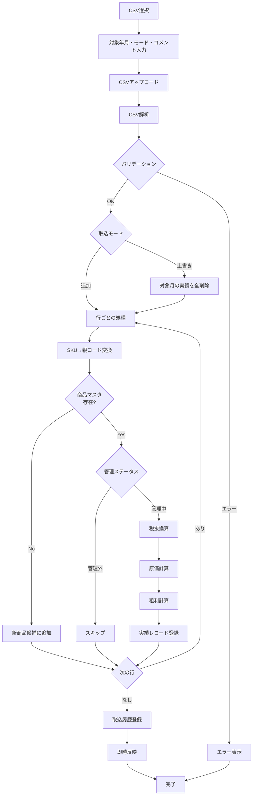
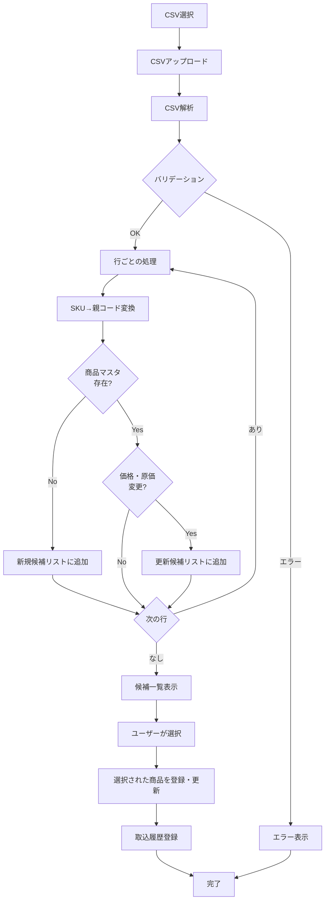

# Rinori 販売管理システム 詳細仕様書 V1.1
## 第2部:CSV取込処理とデータ変換

**バージョン**: 1.1  
**作成日**: 2025-12-05  
**基準文書**: Rinori 販売管理システム 要件定義書_V1.1

---

## 1. 売上CSV取込処理

### 1.1 売上CSVのフォーマット

ネクストエンジンから出力される売上CSVの想定フォーマット。

| 列番号 | 列名 | 説明 | 例 |
|--------|------|------|-----|
| 1 | 商品コード（SKU） | NEの商品コード | RINO-FR010-X-BLK |
| 2 | 商品名 | 商品名称 | フレアスカート ブラック |
| 3 | 受注数 | 販売数量 | 5 |
| 4 | 売上金額（税込） | 税込売上金額 | 55,000 |

**備考**:
- CSVはヘッダー行を含む
- 文字コード: Shift_JIS または UTF-8（自動判定）
- 数値にカンマ区切りが含まれる場合は除去して処理
- **売上日（日付列）は存在しない**ため、実績は対象年月単位で管理

### 1.2 取込処理フロー



### 1.3 取込モード

#### 1.3.1 追加モード（append）

**動作**:
- 既存の実績レコードはそのまま保持
- CSVの内容を新規レコードとして追加（差分追加・累積）
- 同一商品・同一月に複数レコードが存在可能

**用途**:
- 月中の部分的な売上データを追加
- 未反映分のみを取り込む運用

**注意点**:
- 同じCSVを複数回取り込むと重複する
- 重複排除機能は提供しない（運用でカバー）

#### 1.3.2 上書きモード（overwrite）

**動作**:
1. 対象年月の全実績レコードを削除
2. CSVの内容を新規レコードとして登録

**SQL例**:
```sql
DELETE FROM sales_records 
WHERE period_ym = '2025-10';
```

**用途**:
- 月末の確定データで月全体を入れ直す
- データの修正・再取込

**注意点**:
- 対象月の全データが削除されるため、確認ダイアログを表示
- 削除前のデータはバックアップ不可（将来拡張で履歴保持を検討）

### 1.4 行ごとの処理詳細

#### ステップ1: SKU → 親コード変換
- CSV の「商品コード（SKU）」を親コードに変換
- 変換ルールは第1部の「4. SKU → 親コード変換ルール」を参照
- **V1.1の新ルール**を使用

#### ステップ2: 商品マスタの存在チェック
```sql
SELECT product_code, management_status, cost_excl_tax
FROM products
WHERE product_code = '変換後の親コード';
```

**存在しない場合**:
- `new_product_candidates` テーブルに追加
- 当該行の実績は登録しない（スキップ）

**存在する場合**:
- 次のステップへ

#### ステップ3: 管理ステータスチェック
- `management_status = 'unmanaged'` の場合はスキップ
- `management_status = 'managed'` の場合は次のステップへ

#### ステップ4: 税抜換算
```
税別売上 = 税込売上 ÷ (1 + 税率)
```
- 税率は対象年月に適用される税率を使用
- 丸め: HALF_UP、小数点以下2桁

#### ステップ5: 原価計算
```
原価金額 = 商品マスタの原価 × 受注数
```
- 商品マスタの `cost_excl_tax` が NULL の場合は 0 として扱う

#### ステップ6: 粗利計算
```
粗利 = 税別売上 - 原価金額
```

#### ステップ7: 実績レコード登録
```sql
INSERT INTO sales_records (
    product_code,
    period_ym,
    sales_date,
    quantity,
    sales_amount_excl_tax,
    cost_amount_excl_tax,
    gross_profit,
    import_history_id,
    created_by_user_id
) VALUES (
    '親コード',
    '対象年月',
    NULL,  -- 売上日は現在NULL
    受注数,
    税別売上,
    原価金額,
    粗利,
    取込履歴ID,
    ログインユーザーID
);
```

**V1.1の変更点**:
- `sales_date` カラムを追加（現在はNULL運用）
- `created_by_user_id` カラムを追加

### 1.5 実績の即時反映【V1.1強調】

取込完了後、以下の集計が**即時更新**される:
- 月次PL
- 商品別PL
- 予算 vs 実績
- ダッシュボードの今月サマリ

**実装上の注意**:
- トランザクション完了後、キャッシュをクリア
- 集計クエリは都度実行（リアルタイム性を優先）

### 1.6 バリデーション

**CSV形式チェック**:
- ヘッダー行の存在確認
- 必須列（商品コード、受注数、売上金額）の存在確認
- データ行が1行以上存在すること

**データチェック**:
- 受注数が整数であること
- 売上金額が数値であること
- 対象年月が YYYY-MM 形式であること

**エラー時の動作**:
- エラーメッセージを表示
- 取込処理を中断（ロールバック）
- エラー内容を詳細に表示（行番号、エラー理由）

### 1.7 取込履歴の登録

取込完了後、`import_histories` テーブルに履歴を登録。

```sql
INSERT INTO import_histories (
    import_type,
    target_ym,
    import_mode,
    comment,
    record_count,
    imported_by_user_id,
    imported_at
) VALUES (
    'sales',
    '2025-10',
    'append',
    'ユーザー入力のコメント',
    取込件数,
    ログインユーザーID,
    CURRENT_TIMESTAMP
);
```

**V1.1の変更点**:
- `imported_by_user_id` カラムを追加

### 1.8 新商品候補の処理

売上CSV取込時に商品マスタに存在しない親コードを検出した場合。

**処理**:
```sql
INSERT INTO new_product_candidates (
    product_code,
    sample_sku,
    product_name,
    status,
    detected_at
) VALUES (
    '親コード',
    '元SKU',
    'CSV の商品名',
    'pending',
    CURRENT_TIMESTAMP
)
ON DUPLICATE KEY UPDATE
    sample_sku = VALUES(sample_sku),
    product_name = VALUES(product_name);
```

**重複時の動作**:
- 既に同じ親コードの候補が存在する場合は更新（sample_sku と product_name を上書き）

**ユーザー通知**:
- 取込完了画面に「新商品候補が X 件検出されました」と表示
- 新商品候補一覧画面へのリンクを表示

---

## 2. 商品一覧CSV取込処理

### 2.1 商品一覧CSVのフォーマット

ネクストエンジンから出力される商品一覧CSVの想定フォーマット。

| 列番号 | 列名 | 説明 | 例 |
|--------|------|------|-----|
| 1 | 商品コード（SKU） | NEの商品コード | RINO-FR010-X-BLK |
| 2 | 商品名 | 商品名称 | フレアスカート ブラック |
| 3 | 原価（税別） | 仕入原価 | 3,000 |
| 4 | 販売価格（税別） | 定価 | 10,000 |
| 5〜 | その他 | 在庫数など（使用しない） | - |

**備考**:
- 原価は左から3列目
- 販売価格は左から4列目（定価として扱う）
- その他の列は無視

### 2.2 取込処理フロー



### 2.3 差分検出ロジック

#### 新規候補の条件
```sql
SELECT '親コード' AS product_code
FROM (CSVデータ) csv
WHERE NOT EXISTS (
    SELECT 1 FROM products 
    WHERE product_code = csv.親コード
);
```

#### 更新候補の条件
```sql
SELECT p.product_code
FROM products p
INNER JOIN (CSVデータ) csv ON p.product_code = csv.親コード
WHERE p.product_name != csv.商品名
   OR p.sales_price_excl_tax != csv.販売価格
   OR p.cost_excl_tax != csv.原価;
```

### 2.4 候補一覧画面の仕様

**表示項目**:
- チェックボックス（一括選択可）
- 親コード
- 商品名（新規の場合はCSVの値、更新の場合は旧→新を表示）
- 販売価格（税別）（旧→新）
- 原価（税別）（旧→新）
- 区分（新規 / 更新）

**操作**:
- 全選択 / 全解除
- 個別選択
- 「登録・更新」ボタン

**登録・更新処理**:
- 選択された商品のみを処理
- 新規の場合は INSERT
- 更新の場合は UPDATE

**新規登録のデフォルト値**:
- product_type: 'own'（自社）
- management_status: 'managed'（管理中）

### 2.5 取込履歴の登録

```sql
INSERT INTO import_histories (
    import_type,
    target_ym,
    import_mode,
    comment,
    record_count,
    imported_by_user_id,
    imported_at
) VALUES (
    'products',
    NULL,
    NULL,
    'ユーザー入力のコメント',
    登録・更新件数,
    ログインユーザーID,
    CURRENT_TIMESTAMP
);
```

**V1.1の変更点**:
- `imported_by_user_id` カラムを追加

---

## 3. 広告費の入力（V1.1変更）

### 3.1 広告費の入力方式

**V1.1での変更**:
- 広告費CSV取込画面は削除
- 広告費カテゴリ管理画面は削除
- **手入力のみ**で広告費を登録

### 3.2 広告費の手入力

**入力項目**:
- 日付（YYYY-MM-DD）
- 金額
- カテゴリ（選択）
- 備考（任意）

**カテゴリの管理**:
- カテゴリマスタ（ad_categories）は事前に登録
- 広告費入力画面でカテゴリを選択
- カテゴリの追加・編集は別途管理画面で実施（簡易的なもの）

### 3.3 広告費レコードの登録

```sql
INSERT INTO ad_expenses (
    expense_date,
    amount,
    ad_category_id,
    memo,
    created_by_user_id
) VALUES (
    '2025-10-15',
    50000.00,
    (SELECT id FROM ad_categories WHERE category_name = 'META広告'),
    'メモ',
    ログインユーザーID
);
```

**V1.1の変更点**:
- `created_by_user_id` カラムを追加
- CSV取込機能は削除

---

## 4. CSV取込共通仕様

### 4.1 文字コード判定

- UTF-8 と Shift_JIS の自動判定
- BOM付きUTF-8 にも対応

### 4.2 数値のパース

- カンマ区切り（1,000）を除去
- 全角数字を半角に変換
- 空白をトリミング

### 4.3 エラーハンドリング

**エラー種別**:
1. **形式エラー**: CSV形式が不正
2. **データエラー**: 必須項目が空、型が不正
3. **業務エラー**: 税率未設定など

**エラー表示**:
- エラー種別
- 行番号
- エラー内容
- 該当データ

**ロールバック**:
- エラー発生時は全てロールバック
- 部分的な取込は行わない

### 4.4 取込履歴の活用

**履歴一覧画面**:
- 取込日時の降順で表示
- 取込種別でフィルタ可能（売上 / 商品一覧）
- 対象年月でフィルタ可能

**表示項目**:
- 取込日時
- 取込種別（売上 / 商品一覧）
- 対象年月
- 取込モード
- コメント
- 取込件数
- 取込実行ユーザー【V1.1追加】

---

## 5. データ整合性チェック

### 5.1 取込時のチェック

**売上CSV取込時**:
- 対象年月の税率が設定されているか
- 管理中の商品の原価が設定されているか（警告のみ）

**商品一覧CSV取込時**:
- 販売価格 > 0
- 原価 >= 0

### 5.2 取込後のチェック

**不完全マスタの検出**:
```sql
SELECT product_code, product_name, sales_price_excl_tax, cost_excl_tax
FROM products
WHERE management_status = 'managed'
  AND (product_name IS NULL 
    OR sales_price_excl_tax IS NULL 
    OR cost_excl_tax IS NULL);
```

**検出時の動作**:
- トップページに警告表示
- 警告をクリックすると不完全マスタの詳細をポップアップ表示

**V1.1の変更点**:
- 不完全マスタ一覧画面は削除
- 警告とポップアップのみで対応

---

この仕様書は第2部として、CSV取込処理とデータ変換ロジックの詳細を定義しました。
次の第3部では、予算管理とPL計算の詳細を定義します。
