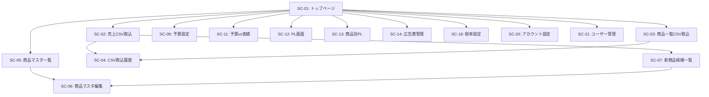

# Rinori 販売管理システム 詳細仕様書 V1.4
## 第4部：画面仕様と画面遷移

**バージョン**: 1.4  
**作成日**: 2025-12-11  
**基準文書**: Rinori 販売管理システム 要件定義書_V1.3

---

## 1. 画面一覧

### 1.1 画面リスト【V1.4更新】

| 画面ID | 画面名 | 説明 | V1.4変更 |
|--------|--------|------|---------|
| SC-01 | トップページ / ダッシュボード | システムの入口、サマリ表示 | - |
| SC-02 | 売上CSV取込画面 | 売上CSVのアップロードと取込 | **テンプレCSVダウンロード追加** |
| SC-03 | 商品一覧CSV取込画面 | 商品一覧CSVのアップロードと差分登録 | **一括選択機能追加** |
| SC-04 | CSV取込履歴画面 | 過去の取込履歴一覧 | - |
| SC-05 | 商品マスタ一覧画面 | 商品マスタの一覧・検索・フィルタ | - |
| SC-06 | 商品マスタの新規登録・編集 | 商品マスタの新規登録・編集 | - |
| SC-07 | 新商品候補一覧画面 | 売上CSVから検出された新商品候補 | - |
| SC-09 | **予算設定画面** | **月別・期間予算の統合設定** | **SC-10と統合** |
| SC-11 | 予算 vs 実績一覧画面 | 商品別の予算進捗確認 | - |
| SC-12 | PL画面（月次・期間） | 月次または期間のPL表示 | **基準月初期値を前月に変更** |
| SC-13 | 商品別PL画面 | 商品ごとのPL一覧 | **販売数量・平均単価表示追加** |
| SC-14 | **広告費管理画面** | **広告費の一覧・追加・編集・削除** | **SC-15と統合** |
| SC-18 | 税率設定画面 | 税率マスタの管理 | - |
| SC-20 | アカウント設定画面 | 自分のパスワード変更（全ユーザー共通） | **V1.3拡張** |
| SC-21 | ユーザー管理画面 | ユーザー一覧・権限変更・パスワードリセット（マスター権限のみ） | **V1.3拡張** |

**V1.3で削除された画面**:
- ~~SC-10: 期間予算編集画面~~ → SC-09に統合
- ~~SC-15: 広告費一覧画面~~ → SC-14に統合
- ~~SC-08: コード変換チェック画面~~
- ~~SC-16: 広告費CSV取込画面~~
- ~~SC-17: 広告費カテゴリ管理画面~~
- ~~SC-19: 不完全マスタ一覧画面~~

### 1.2 画面遷移図【V1.3更新】



---

## 2. 画面詳細仕様

### SC-01: トップページ / ダッシュボード【V1.1権限制御追加】

**目的**: システムの入口として、重要な情報をサマリ表示し、各機能へのナビゲーションを提供。

#### 表示項目

**1. 今月のサマリ（マスター権限のみ）**【V1.1変更】
- 対象月: 現在月（YYYY-MM）
- 売上（税別）
- 粗利
- 営業利益（粗利 - 広告費）
- 各項目の率（原価率・粗利率・広告率・利益率）

**権限による表示制御**:
- **マスター権限**: 今月のサマリを表示
- **スタッフ権限**: 今月のサマリを**非表示**

**2. 今月の主要商品 予算 vs 実績**
- 売上上位5商品の予算達成率を表示
- 商品コード、商品名、予算数量、実績数量、達成率

**権限による表示制御**:
- **マスター権限**: 表示
- **スタッフ権限**: 表示

**3. 警告・通知エリア**
- 不完全マスタの警告（件数とクリックで詳細表示）
- 新商品候補の有無（件数とリンク）

**4. ナビゲーションメニュー**
- 売上管理
  - 売上CSV取込
  - CSV取込履歴
- 商品管理
  - 商品マスタ一覧
  - 商品一覧CSV取込
  - 新商品候補一覧
- 予算管理
  - 月別予算設定
  - 期間予算編集
  - 予算 vs 実績
- PL・分析
  - PL画面（マスター権限のみ総合計表示）
  - 商品別PL
- 広告費管理
  - 広告費一覧
  - 広告費入力
- 設定
  - アカウント設定（全ユーザー共通）【SC-20】
  - ユーザー管理（マスター権限のみ表示）【SC-21】
  - 税率設定

---

### SC-02: 売上CSV取込画面

**目的**: ネクストエンジンの売上CSVをアップロードし、実績データに反映。

#### 入力項目

| 項目名 | 必須 | 形式 | 説明 |
|--------|------|------|------|
| 対象年月 | ○ | YYYY-MM | 取込対象の年月 |
| 取込モード | ○ | 選択 | 追加 / 上書き |
- **即時反映**: 月次PL・商品別PL・予算vs実績が即時更新【V1.1強調】

#### CSVテンプレート【V1.4追加】

- 画面上部に「売上CSVテンプレートをダウンロード」ボタンを配置。
- ダウンロードされるテンプレートCSVの1行目ヘッダーは以下の通り:
  - `商品コード（SKU）`
  - `商品名`
  - `受注日`
  - `受注数`
  - `売上金額（税込）`
- 利用者は1行目のヘッダーを変更せずに、2行目以降に売上データを入力してCSV形式で保存する。

- **即時反映**: 月次PL・商品別PL・予算vs実績が即時更新【V1.1強調】

---

### SC-03: 商品一覧CSV取込画面

**目的**: ネクストエンジンの商品一覧CSVから、商品マスタの一括登録・差分更新。

#### 入力項目

| 項目名 | 必須 | 形式 | 説明 |
|--------|------|------|------|
| CSVファイル | ○ | ファイル | 商品一覧CSV |
| コメント | - | テキスト | 任意のコメント |

#### 操作

1. CSVファイルを選択
2. コメントを入力（任意）
3. 「差分チェック」ボタンをクリック
4. 差分候補一覧が表示される
5. **一括選択機能**【V1.3追加】:
   - 「全て選択」ボタン: 全ての候補にチェックを入れる
   - 「全て解除」ボタン: 全てのチェックを外す
6. 登録・更新したい商品をチェック
7. 「登録・更新」ボタンをクリック

---

### SC-04: CSV取込履歴画面

**目的**: 過去のCSV取込履歴を一覧表示。

#### 表示項目

| 列名 | 説明 |
|------|------|
| 取込日時 | imported_at |
| 取込種別 | すべて / 売上 / 商品一覧 |
| 対象年月 | target_ym（売上の場合のみ） |
| 取込モード | 追加 / 上書き（売上の場合のみ） |
| コメント | comment |
| 取込件数 | record_count |
| 取込実行ユーザー | username【V1.1追加】 |

---

### SC-05: 商品マスタ一覧画面

**目的**: 商品マスタの一覧表示、検索、フィルタ、編集。

#### 表示項目

| 列名 | 説明 |
|------|------|
| 商品コード | product_code |
| 商品名 | product_name |
| 販売価格（税別） | sales_price_excl_tax |
| 原価（税別） | cost_excl_tax |
| 商品区分 | 自社 / 仕入 |
| 管理ステータス | 管理中 / 管理外 |
| 登録日 | created_at |
| 操作 | 編集ボタン |

#### ソート・フィルタ・検索

- 全列でソート可能
- フィルタ: 商品区分、管理ステータス
- 検索: 商品コード・商品名のキーワード検索

---

### SC-06: 商品マスタ編集画面

**目的**: 商品マスタの新規登録・編集。

#### 入力項目

| 項目名 | 必須 | 形式 | 説明 |
|--------|------|------|------|
| 商品コード | ○ | テキスト | product_code（新規時のみ入力可） |
| 商品名 | ○ | テキスト | product_name |
| 販売価格（税別） | ○ | 数値 | sales_price_excl_tax |
| 原価（税別） | ○ | 数値 | cost_excl_tax |
| 商品区分 | ○ | 選択 | 自社 / 仕入 |
| 管理ステータス | ○ | 選択 | 管理中 / 管理外 |

---

### SC-07: 新商品候補一覧画面

**目的**: 売上CSVから検出された未登録商品の候補を表示し、マスタ登録または無視を選択。

#### 表示項目

| 列名 | 説明 |
|------|------|
| チェックボックス | 選択 |
| 親コード | product_code |
| 元SKU例 | sample_sku |
| 商品名 | product_name（CSVにあれば） |
| 検出日時 | detected_at |
| 操作 | 管理中として登録 / 管理外として登録 / 無視 |

---

### SC-09: 予算設定画面【V1.3統合】

**目的**: 月別予算および期間予算を統合的に設定。

#### 画面構成

**1. 期間設定・検索エリア**

| 項目名 | 必須 | 形式 | 説明 |
|--------|------|------|------|
| 開始年月 | ○ | YYYY-MM | 期間の開始月 |
| 終了年月 | ○ | YYYY-MM | 期間の終了月 |
| 商品検索 | - | テキスト | 商品コード・商品名の部分一致検索 |

操作:
1. 開始年月・終了年月を選択
2. （任意）検索キーワードを入力
3. 「表示」ボタンをクリック
4. → 条件に一致する管理中の商品が一覧表示される

**ソート機能**:
- 商品コード列ヘッダーをクリックで昇順/降順ソート可能

**2. 期間合計サマリ（画面上部）**

全商品の期間合計をリアルタイム表示:
- 合計売上（税別）
- 合計粗利
- 粗利率

**3. 商品別予算テーブル（Excel型UI）**

#### テーブル列構成

| 列名 | 説明 | 編集可否 | 位置 |
|------|------|---------|------|
| 商品コード | product_code | 表示のみ | 固定（左） |
| 商品名 | product_name | 表示のみ | 固定（左） |
| **期間合計数量** | 入力欄 | **編集可** | 固定（左） |
| **期間売上（税別）** | 自動計算 | 表示のみ | 固定（左） |
| **期間粗利** | 自動計算 | 表示のみ | 固定（左） |
| 01月 | 月別数量 | **編集可** | スクロール |
| 02月 | 月別数量 | **編集可** | スクロール |
| ... | ... | ... | スクロール |

#### 動作仕様

**入力パターンA: 期間合計から入力**
1. 期間合計数量を入力
2. → 月別数量に自動配分（等分、端数は最終月）
3. → 期間売上・粗利を自動計算
4. → サマリ更新

**入力パターンB: 月別数量から入力**
1. 任意の月の数量を直接編集
2. → 期間合計数量を再計算（合計値で更新）
3. → 期間売上・粗利を再計算
4. → サマリ更新

**リアルタイム自動計算**:
- 入力と同時に全ての計算が行われる
- 保存ボタンを押す前に結果を確認可能
- **常に期間合計と月別合計が一致する**（Excel型UI）
| 商品コード | product_code |
| 商品名 | product_name |
| 予算数量 | SUM(budget_quantity) |
| 実績数量 | SUM(quantity) |
| 数量達成率 | 実績数量 ÷ 予算数量 × 100 |
| 予算売上（税別） | SUM(budget_sales_excl_tax) |
| 実績売上（税別） | SUM(sales_amount_excl_tax) |
| 売上達成率 | 実績売上 ÷ 予算売上 × 100 |

---

### SC-12: PL画面（月次・期間）【V1.1権限制御追加、V1.3 UI改善、V1.4 初期表示追加】

**目的**: 月次または期間のPLを表示。

#### 期間選択（ラジオボタン方式）【V1.3改善】

**選択方式1: プリセット期間**

| 期間種別 | 説明 |
|---------|------|
| 単月 | 特定の1ヶ月 |
| 3ヶ月 | 直近3ヶ月 |
| 6ヶ月 | 直近6ヶ月 |
| 期首〜現在 | 年度開始〜現在月 |

**選択方式2: 任意の期間**

- 開始年月: YYYY-MM
- 終了年月: YYYY-MM

**UI動作**:
- ラジオボタンで選択した方式のみが有効
- 非選択の方式はグレーアウト（disabled）
- 「表示」ボタンで選択中の方式で期間を決定

#### 初期表示【V1.4追加】

- 画面表示時の基準月初期値は「システム日付の前月」とする。
  - 例: システム日付が 2025-12-11 の場合、基準月 = 2025-11。
- プリセット期間（単月 / 3ヶ月 / 6ヶ月 / 期首〜現在）は、この基準月を起点として集計期間を算出する。

#### 表示項目（マスター権限）

```
売上（税別）:        1,000,000円
原価（税別）:         -400,000円 (40.0%)
─────────────────────────────
粗利:                  600,000円 (60.0%)
広告費:               -200,000円 (20.0%)
─────────────────────────────
営業利益:              400,000円 (40.0%)
```

#### 表示項目（スタッフ権限）【V1.1追加】

```
🔴 総合計は非表示

※ 商品別PLは閲覧可能
```

**権限による表示制御**:
- **マスター権限**: 総合計を表示
- **スタッフ権限**: 総合計を**非表示**

---

### SC-13: 商品別PL画面

**目的**: 商品ごとのPLを一覧表示。

#### 期間選択・検索

| 項目名 | 必須 | 形式 | 説明 |
|--------|------|------|------|
| 期間種別 | ○ | 選択 | 単月 / 複数月範囲 / 3ヶ月 / 6ヶ月 / 期首〜現在 |
| 商品検索 | - | テキスト | 商品コード・商品名の部分一致検索 |

**初期表示【V1.4追加】**:
- 画面表示時の基準月初期値は「システム日付の前月」（SC-12と同一ロジック）とする。

**ソート機能**:
- 商品コード列ヘッダーをクリックで昇順/降順ソート可能

#### 表示項目

| 列名 | 説明 |
|------|------|
| 商品コード | product_code |
| 商品名 | product_name |
| 販売数量 | SUM(quantity) |
| 売上（税別） | SUM(sales_amount_excl_tax) |
| 原価（税別） | SUM(cost_amount_excl_tax) |
| 粗利 | SUM(gross_profit) |
| 平均単価 | 売上（税別） ÷ 販売数量（販売数量が0の場合は0円とする） |
| 原価率 | 原価 ÷ 売上 × 100 |
| 粗利率 | 粗利 ÷ 売上 × 100 |

**権限による表示制御**:
- **マスター権限**: 表示
- **スタッフ権限**: 表示（商品別は閲覧可能）

---

### SC-14: 広告費管理画面【V1.3統合・UX改善】

**目的**: 広告費の一覧表示、追加、編集、削除、およびカテゴリ管理を一元管理。

#### 画面構成（タブ方式）

**タブ1: 広告費一覧**

| 列名 | 説明 | 編集モード |
|------|------|-----------|
| 日付 | expense_date | インライン編集可 |
| 金額 | amount | インライン編集可 |
| カテゴリ | category_name | インライン編集可 |
| メモ | memo | インライン編集可 |
| 操作 | 削除ボタン | - |

新規追加行（テーブル最下部）:
- 日付: [日付選択]
- 金額: [数値入力]
- カテゴリ: [選択]
- メモ: [テキスト入力]
- 操作: [保存]ボタン

**タブ2: カテゴリ管理**【V1.3新規追加】

| 列名 | 説明 | 編集モード |
|------|------|-----------|
| カテゴリ名 | category_name | インライン編集可 |
| 作成日 | created_at | 表示のみ |
| 操作 | 削除ボタン | - |

新規追加行（テーブル最下部）:
- カテゴリ名: [テキスト入力]
- 操作: [保存]ボタン

#### 操作仕様

**広告費の新規追加**:
1. 最下部の新規追加行に入力
2. 「保存」ボタンをクリック
3. → 一覧に追加され、入力欄はクリアされる

**広告費の編集**:
1. 既存行のセルをクリック
2. 内容を変更
3. フォーカスを外すと自動保存

**広告費の削除**:
1. 削除ボタンをクリック
2. 確認ダイアログでOK
3. → 行が削除される

**カテゴリの管理**:
1. 「カテゴリ管理」タブをクリック
2. 新規追加行でカテゴリ名を入力して保存
3. 既存カテゴリはインライン編集または削除可能

---

### SC-18: 税率設定画面

**目的**: 税率マスタの管理。

#### 表示項目

| 列名 | 説明 |
|------|------|
| 適用開始年月 | start_ym |
| 税率 | rate（%表示） |
| 操作 | 編集 / 削除 |

---

### SC-20: アカウント設定画面（自分のパスワード変更）

**目的**: ログイン中のユーザーが、自分のパスワードを安全に変更できるようにする。

**権限**:
- マスター権限 / スタッフ権限 共通（ログイン必須）

#### 入力項目

| 項目名 | 必須 | 形式 | 説明 |
|--------|------|------|------|
| 現在のパスワード | ○ | パスワード | 現在のパスワードを入力 |
| 新しいパスワード | ○ | パスワード | 変更後のパスワード |
| 新しいパスワード（確認） | ○ | パスワード | 新しいパスワードと同じ値を再入力 |

#### 動作仕様

1. ユーザーが全ての項目を入力し、「変更」ボタンをクリック。
2. システムは現在のパスワードを照合し、一致しない場合はエラーメッセージを表示し処理を中断。
3. 新しいパスワードと確認用パスワードが一致しない場合もエラーとし、処理を中断。
4. 条件を満たす場合、users.password_hash をハッシュ化された新しいパスワードで更新。
5. 更新成功時は「パスワードを変更しました」のメッセージを表示し、必要に応じて再ログインを促す（実装側判断）。

#### バリデーション（概要）

- パスワードの長さ: 最低8文字以上（上限は仕様書第5部のセキュリティポリシーに準拠）。
- アカウントロック方針など、詳細はセキュリティ仕様に従う。

---

### SC-21: ユーザー管理画面（マスター権限のみ）

**目的**: マスター権限ユーザーが、ユーザーアカウント（ユーザー名・権限・パスワード初期化）を一元管理できるようにする。

**権限**:
- マスター権限のみアクセス可能。スタッフ権限ユーザーにはメニューおよび画面を表示しない。

#### 表示項目

| 列名 | 説明 |
|------|------|
| ユーザー名 | username |
| 権限 | role（マスター / スタッフ） |
| 作成日時 | created_at |
| 操作 | 権限変更 / パスワードリセット |

#### 主な機能

1. ユーザー一覧表示
   - 全ユーザーの一覧をテーブルで表示。
   - ユーザー名または権限での簡易フィルタ・検索が可能でもよい（任意）。

2. ユーザー新規作成
   - 入力項目: ユーザー名、権限種別（マスター / スタッフ）、初期パスワード。
   - 登録ボタン押下で users テーブルにレコードを追加し、パスワードはハッシュ化して保存。
   - 作成後、初期パスワードを画面上に1度だけ表示する（再表示不可）。

3. 権限変更
   - 対象ユーザーの権限をマスター / スタッフ間で切り替え可能。
   - システムに少なくとも1名以上のマスター権限ユーザーが必ず存在するように制御する。
     - 最後の1人のマスター権限ユーザーをスタッフに変更しようとした場合はエラーとする。

4. パスワードリセット
   - 対象ユーザーのパスワードを新しい一時パスワードにリセットし、その値を画面上に表示する。
   - 一時パスワードは後から再表示できない前提とし、利用者は受領後に速やかに自分のパスワードを変更する運用とする。

#### エラーハンドリング（概要）

- 既に存在するユーザー名で新規作成しようとした場合は「ユーザー名が重複しています」等のエラーを表示。
- 自分自身の権限をスタッフに変更してログイン不可となるような操作はエラーとし、実行させないことも検討（運用方針により決定）。

---

## 3. 共通UI仕様

### 3.1 ヘッダー

全画面共通のヘッダーを表示。
- システム名: 「Rinori 販売管理システム」
- ナビゲーションメニュー
- ユーザー名と権限表示【V1.1追加】
- ログアウトボタン【V1.1追加】

### 3.2 権限による表示制御【V1.1追加】

**マスター権限**:
- すべての画面・機能にアクセス可能
- 月次PL・期間PLの総合計を表示

**スタッフ権限**:
- 広告費入力、商品別実績・PL閲覧は可能
- 月次PL・期間PLの総合計は非表示

### 3.3 フッター

全画面共通のフッターを表示。

- コピーライト
- バージョン情報

### 3.4 エラー表示

- エラーメッセージは画面上部に赤色で表示
- 複数エラーがある場合はリスト表示

### 3.5 成功メッセージ

- 成功メッセージは画面上部に緑色で表示
- 3秒後に自動的に消える

### 3.6 確認ダイアログ

- 削除や上書きなど、重要な操作の前に確認ダイアログを表示
- 「OK」「キャンセル」ボタン

### 3.7 ローディング

- 処理中はローディングインジケーターを表示
- 長時間処理の場合はプログレスバーを表示

---

この仕様書は第4部として、画面仕様と画面遷移の詳細を定義しました。
次の第5部では、処理フローとバリデーションルールの詳細を定義します。
