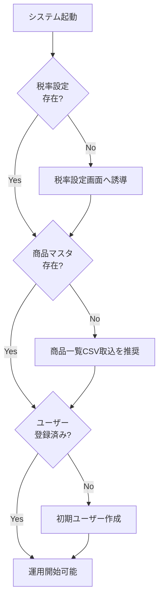
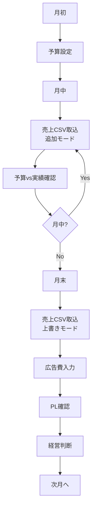
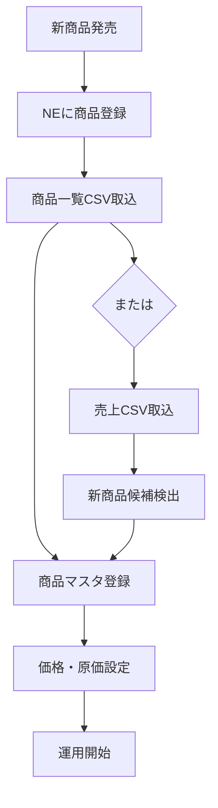

# Rinori 販売管理システム 詳細仕様書 V1.1
## 第5部：処理フローとバリデーション

**バージョン**: 1.1  
**作成日**: 2025-12-05  
**基準文書**: Rinori 販売管理システム 要件定義書_V1.1

---

## 1. 全体処理フロー

### 1.1 初期セットアップフロー



**初期データ**:
- 税率設定: start_ym='2019-10', rate=0.100（10%）をデフォルト登録
- ユーザー: username='admin', role='master'（初期管理者アカウント）

---

## 2. 月次運用フロー

### 2.1 標準的な月次運用



### 2.2 新商品発生時のフロー



**V1.1の変更点**:
- コード変換チェック画面は削除されたため、NEに商品登録後は直接CSV取込へ

---

## 3. バリデーションルール一覧

### 3.1 ユーザー【V1.1追加】

| 項目 | ルール | エラーメッセージ |
|------|--------|-----------------|
| username | 必須、1〜50文字 | ユーザー名は1〜50文字で入力してください |
| username | 重複不可 | このユーザー名は既に登録されています |
| password | 必須、8文字以上 | パスワードは8文字以上で入力してください |
| role | 必須、'master'または'staff' | 権限を選択してください |

### 3.2 商品マスタ

| 項目 | ルール | エラーメッセージ |
|------|--------|-----------------|
| product_code | 必須、1〜50文字 | 商品コードは1〜50文字で入力してください |
| product_code | 重複不可（新規時） | この商品コードは既に登録されています |
| product_name | 管理中の場合必須、1〜200文字 | 商品名は1〜200文字で入力してください |
| sales_price_excl_tax | 管理中の場合必須、0以上 | 販売価格は0以上の数値を入力してください |
| cost_excl_tax | 管理中の場合必須、0以上 | 原価は0以上の数値を入力してください |
| product_type | 必須、'own'または'purchase' | 商品区分を選択してください |
| management_status | 必須、'managed'または'unmanaged' | 管理ステータスを選択してください |

### 3.3 売上CSV取込

| 項目 | ルール | エラーメッセージ |
|------|--------|-----------------|
| 対象年月 | 必須、YYYY-MM形式 | 対象年月をYYYY-MM形式で入力してください |
| 取込モード | 必須、'append'または'overwrite' | 取込モードを選択してください |
| CSVファイル | 必須、.csv拡張子、10MB以下 | CSVファイルを選択してください（10MB以下） |
| CSV形式 | ヘッダー行必須 | CSVにヘッダー行がありません |
| CSV形式 | 必須列の存在確認 | 必須列（商品コード、受注数、売上金額）が不足しています |
| 受注数 | 整数 | {行番号}行目: 受注数は整数で入力してください |
| 売上金額 | 数値 | {行番号}行目: 売上金額は数値で入力してください |
| 税率 | 対象年月の税率が設定済み | 対象年月（{YYYY-MM}）の税率が設定されていません |

### 3.4 商品一覧CSV取込

| 項目 | ルール | エラーメッセージ |
|------|--------|-----------------|
| CSVファイル | 必須、.csv拡張子、10MB以下 | CSVファイルを選択してください（10MB以下） |
| CSV形式 | ヘッダー行必須 | CSVにヘッダー行がありません |
| CSV形式 | 必須列の存在確認 | 必須列（商品コード、商品名、原価、販売価格）が不足しています |
| 原価 | 0以上の数値 | {行番号}行目: 原価は0以上の数値で入力してください |
| 販売価格 | 0以上の数値 | {行番号}行目: 販売価格は0以上の数値で入力してください |

### 3.5 月別予算

| 項目 | ルール | エラーメッセージ |
|------|--------|-----------------|
| 対象年月 | 必須、YYYY-MM形式 | 対象年月をYYYY-MM形式で入力してください |
| 予算数量 | 0以上の整数 | 予算数量は0以上の整数を入力してください |
| 予算売上 | 0以上の数値 | 予算売上は0以上の数値を入力してください |

### 3.6 期間予算

| 項目 | ルール | エラーメッセージ |
|------|--------|-----------------|
| 商品コード | 必須 | 商品を選択してください |
| 開始年月 | 必須、YYYY-MM形式 | 開始年月をYYYY-MM形式で入力してください |
| 終了年月 | 必須、YYYY-MM形式 | 終了年月をYYYY-MM形式で入力してください |
| 期間 | start_ym <= end_ym | 終了年月は開始年月以降を指定してください |
| 期間 | 最大24ヶ月 | 期間は最大24ヶ月までです |
| 期間合計数量 | 0以上の整数 | 期間合計数量は0以上の整数を入力してください |

### 3.7 広告費

| 項目 | ルール | エラーメッセージ |
|------|--------|-----------------|
| 日付 | 必須、YYYY-MM-DD形式 | 日付をYYYY-MM-DD形式で入力してください |
| 金額 | 0より大きい数値 | 金額は0より大きい数値を入力してください |
| カテゴリ | 必須 | カテゴリを選択してください |

### 3.8 税率設定

| 項目 | ルール | エラーメッセージ |
|------|--------|-----------------|
| 適用開始年月 | 必須、YYYY-MM形式 | 適用開始年月をYYYY-MM形式で入力してください |
| 適用開始年月 | 重複不可 | この年月の税率は既に登録されています |
| 税率 | 必須、0.000〜1.000 | 税率は0.000〜1.000の範囲で入力してください |

---

## 4. エラーハンドリング

### 4.1 エラーの種類

| エラー種別 | 説明 | 処理 |
|-----------|------|------|
| バリデーションエラー | 入力値の形式・範囲エラー | エラーメッセージ表示、処理中断 |
| 業務エラー | 業務ルール違反（税率未設定など） | エラーメッセージ表示、処理中断 |
| 権限エラー | 権限不足によるアクセス拒否【V1.1追加】 | エラーメッセージ表示、ログイン画面へ |
| システムエラー | DB接続エラー、ファイルI/Oエラーなど | エラーログ記録、エラー画面表示 |

### 4.2 エラー表示の原則

**画面表示**:
- エラーメッセージは画面上部に赤色で表示
- 複数エラーがある場合はリスト表示
- エラー箇所を明示（行番号、項目名など）

**CSV取込時のエラー**:
- エラーがある行番号と内容を一覧表示
- 最大100件までエラーを表示（それ以上は省略）
- エラーがある場合は全てロールバック

### 4.3 トランザクション制御

**原則**:
- 1つの処理単位で1トランザクション
- エラー発生時は全てロールバック
- 部分的な取込・更新は行わない

**例外**:
- 商品一覧CSV取込の差分登録は、ユーザーが選択した商品のみ処理
- 新商品候補の登録は、ユーザーが選択した商品のみ処理

---

## 5. 権限制御【V1.1追加】

### 5.1 権限チェックのタイミング

**ログイン時**:
- ユーザー名とパスワードを検証
- 認証成功後、ユーザー情報（username, role）をセッションに保存

**画面表示時**:
- セッションから権限を取得
- 権限に応じて表示内容を制御

**データ取得時**:
- 権限に応じてクエリを変更
- スタッフ権限の場合、総合計データは取得しない

### 5.2 権限別アクセス制御

**マスター権限**:
- すべての画面・機能にアクセス可能
- すべてのデータを閲覧・編集可能

**スタッフ権限**:
- 広告費入力、商品別実績・PL閲覧は可能
- 月次PL・期間PLの総合計は非表示
- 商品マスタ編集、予算設定などは制限なし

### 5.3 権限チェックの実装例

```sql
-- マスター権限のみ総合計を取得
SELECT 
    SUM(sales_amount_excl_tax) AS total_sales,
    SUM(cost_amount_excl_tax) AS total_cost,
    SUM(gross_profit) AS total_gross_profit
FROM sales_records sr
INNER JOIN products p ON sr.product_code = p.product_code
WHERE p.management_status = 'managed'
  AND sr.period_ym = '2025-10'
  AND :user_role = 'master';  -- 権限チェック
```

---

## 6. データ整合性チェック

### 6.1 取込前チェック

**売上CSV取込前**:
```sql
-- 税率設定の存在確認
SELECT COUNT(*) 
FROM tax_rates 
WHERE start_ym <= '対象年月';
```
- 結果が 0 の場合はエラー: 「対象年月の税率が設定されていません」

**商品一覧CSV取込前**:
- 特になし（差分検出後にユーザーが選択）

### 6.2 取込後のチェック

**売上CSV取込後**:
```sql
-- 不完全マスタの検出
SELECT COUNT(*) 
FROM products 
WHERE management_status = 'managed'
  AND (product_name IS NULL 
    OR sales_price_excl_tax IS NULL 
    OR cost_excl_tax IS NULL);
```
- 結果が 0 より大きい場合は警告表示

**商品一覧CSV取込後**:
- 特になし

### 6.3 定期チェック

**トップページ表示時**:
- 不完全マスタの件数をチェック
- 新商品候補の件数をチェック

---

## 7. パフォーマンス考慮事項

### 7.1 インデックス戦略

**必須インデックス**:
- users.username（ユニーク）【V1.1追加】
- products.product_code（主キー）
- products.management_status
- sales_records.period_ym
- sales_records.(product_code, period_ym)
- sales_records.sales_date【V1.1追加】
- monthly_budgets.(product_code, period_ym)
- ad_expenses.expense_date
- tax_rates.start_ym

### 7.2 大量データ処理

**CSV取込**:
- バッチINSERTを使用（1000件ごと）
- トランザクションは全体で1つ

**PL計算**:
- 集計クエリは期間を限定
- 不要な商品（管理外）は集計から除外
- 権限に応じてクエリを最適化【V1.1追加】

### 7.3 キャッシュ戦略

**商品マスタ**:
- 頻繁に参照されるため、アプリケーション側でキャッシュ
- CSV取込時にキャッシュをクリア

**税率設定**:
- 変更頻度が低いため、アプリケーション側でキャッシュ
- 税率設定変更時にキャッシュをクリア

**ユーザー情報**【V1.1追加】:
- ログイン時にセッションに保存
- ログアウト時にセッションをクリア

---

## 8. セキュリティ考慮事項

### 8.1 認証・認可【V1.1追加】

**認証**:
- ユーザー名とパスワードによる認証
- パスワードはハッシュ化して保存（bcryptなど）
- セッション管理（HTTPOnly Cookie）

**認可**:
- 権限（role）に基づくアクセス制御
- 画面レベル・データレベルで制御

**セッション管理**:
- セッションタイムアウト: 30分
- ログアウト時にセッションを破棄

### 8.2 入力値の検証

**SQLインジェクション対策**:
- プリペアドステートメントを使用
- ユーザー入力を直接SQLに埋め込まない

**XSS対策**:
- 出力時にHTMLエスケープ
- ユーザー入力をそのまま表示しない

**CSVインジェクション対策**:
- CSV出力時、先頭が `=`, `+`, `-`, `@` の場合は `'` を付与

### 8.3 ファイルアップロード

**制限**:
- 拡張子: .csv のみ
- ファイルサイズ: 10MB以下
- ファイル名: 日本語・特殊文字を含む場合はサニタイズ

---

## 9. ログ・監査

### 9.1 ログ記録

**アクセスログ**:
- 画面アクセス日時
- 操作内容（CSV取込、商品マスタ編集など）
- ユーザー名【V1.1追加】

**エラーログ**:
- エラー発生日時
- エラー種別
- エラー内容
- スタックトレース
- ユーザー名【V1.1追加】

**CSV取込ログ**:
- import_histories テーブルに記録
- 取込日時、取込種別、対象年月、取込モード、件数
- 取込実行ユーザー【V1.1追加】

### 9.2 監査証跡

**変更履歴**:
- 期間予算の変更履歴を period_budget_histories に保存【V1.1追加】
- 将来拡張で商品マスタ変更履歴、予算変更履歴なども検討

---

## 10. バックアップ・リカバリ

### 10.1 バックアップ方針

**データベース**:
- 日次バックアップ（深夜実行）
- バックアップ世代: 7日分保持

**CSV取込前**:
- 上書きモード時は、削除前のデータをバックアップテーブルに退避
- 将来拡張で検討（現フェーズでは不要）

### 10.2 リカバリ手順

**データベース復旧**:
- バックアップからリストア
- 最新のバックアップ時点まで復旧

**誤操作時の復旧**:
- 現フェーズでは手動で修正
- 将来拡張でロールバック機能を検討

---

## 11. テスト方針

### 11.1 単体テスト

**対象**:
- SKU→親コード変換ロジック【V1.1の新ルール】
- 税抜換算ロジック
- PL計算ロジック
- 予算配分ロジック【V1.1の端数処理変更】
- 権限チェックロジック【V1.1追加】

**テストケース**:
- 正常系: 想定通りの入力
- 異常系: 不正な入力、境界値
- 特殊ケース: NULL、0、負の数など

### 11.2 結合テスト

**対象**:
- CSV取込処理（売上、商品一覧）
- 商品マスタ管理
- 予算管理
- PL計算
- 権限制御【V1.1追加】

**テストケース**:
- 正常系: 標準的な運用フロー
- 異常系: エラー発生時の挙動
- 境界値: 大量データ、最小データ
- 権限別動作確認【V1.1追加】

### 11.3 システムテスト

**対象**:
- 全画面の表示・操作
- 画面遷移
- エラーハンドリング
- 権限による表示制御【V1.1追加】

**テストケース**:
- ユースケースベースのテスト
- 月次運用フローのテスト
- マスター権限・スタッフ権限での動作確認【V1.1追加】

### 11.4 受入テスト

**対象**:
- 実際のNEデータを使用した取込テスト
- 予算設定〜PL確認までの一連の流れ
- 権限別の動作確認【V1.1追加】

**テストケース**:
- 要件定義書のユースケース全て

---

## 12. 将来拡張の考慮事項

### 12.1 マルチブランド対応

**変更点**:
- products テーブルに brand_id カラムを追加
- 全テーブルに brand_id を追加
- ログイン時にブランドを選択

### 12.2 日次PL

**変更点**:
- sales_records.sales_date を活用（現在はNULL）
- 日次集計機能を追加
- 日次推移グラフを追加

### 12.3 商品別広告費配賦

**変更点**:
- ad_expenses に product_code カラムを追加（任意）
- 配賦ルールマスタを追加
- 商品別PLに広告費・営業利益を追加

### 12.4 取込履歴のロールバック

**変更点**:
- 削除前のデータをバックアップテーブルに退避
- ロールバック機能を追加

### 12.5 API連携

**変更点**:
- META広告、Google広告のAPI連携
- 広告費の自動取込

### 12.6 期間予算の自動配分アルゴリズム

**変更点**:
- 重み・季節係数を使った自動配分
- 過去実績に基づく配分

---

この仕様書は第5部として、処理フローとバリデーションルールの詳細を定義しました。
これで全5部の詳細仕様書（V1.1）が完成しました。
